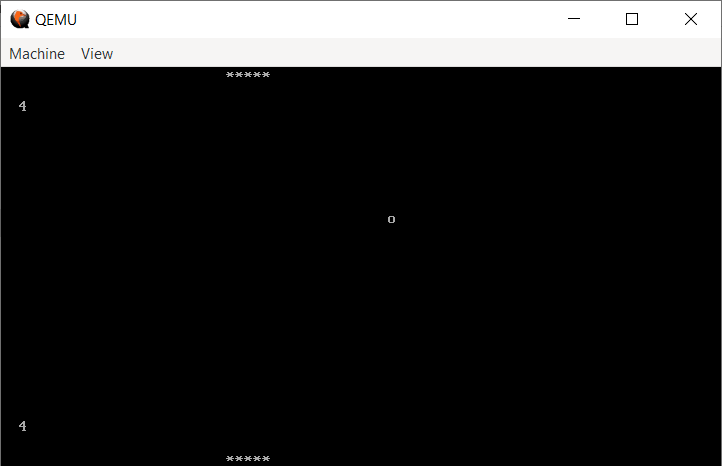

Acest proiect a pornit de la laboratorul 4, exemplul pong, si reprezinta un bootloader BIOS.
Initial, acest proiect era format dintr-o paleta care putea fi controlata de la tastatura si o minge desenata pe ecran.
Contributia personala consta in adaugarea altei palete ce poate fi controlata de la tastatura si implementarea unui scor, precum si implementarea logicii jocului de ping-pong.
Jocul se termina atunci cannd un jucator ajunge la 9 puncte.

Pentru a rula jocul, folositi scriptul rulare.bat, insa asigurati-va inainte ca setati calea voastra catre uasm si qemu in acest script.

Exemplu din mijlocul jocului:
